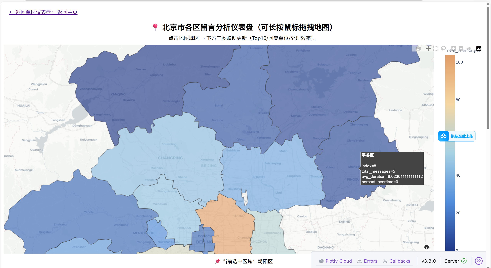
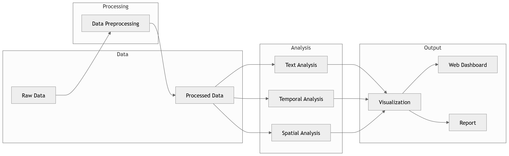

# Beijing Government Message Board Analysis

## Project Overview

This project analyzes citizen messages submitted to the **Beijing section of the People's Daily Online Leadership Message Board**.  
The goal is to explore patterns in citizen concerns, government response efficiency, and regional differences through data science techniques.

The dataset covers the period **2024-01-01 to 2025-12-09** and contains public messages and official responses.

Data source: People's Daily Online Leadership Message Board (Beijing section).

## Dataset

Original data was provided as raw scraped data and further processed into structured datasets.

Key fields include:

- Message content
- Posting time
- Response time
- Responsible government department
- Administrative district
- Processing status

Additional derived features were created during preprocessing, including:

- response duration
- holiday indicators
- temporal aggregation
- spatial mapping fields

## Project Highlights

### Holiday Impact Analysis

A dedicated module analyzes how Chinese public holidays influence:

- message volume
- government response efficiency
- processing delays

Holiday indicators were manually integrated into the dataset to examine temporal variations in public service workload.

### Interactive Web Visualization

An interactive web-based visualization interface was developed to present analysis results.

Features include:

- temporal trend charts
- district-level spatial maps
- keyword analysis dashboards

This allows users to explore citizen feedback patterns through a visual interface.

## Methodology

The analysis pipeline consists of the following steps:

### 1 Data Preprocessing

- Data cleaning and normalization
- Feature engineering
- Response time calculation
- District name standardization

### 2 Text Mining

Natural language processing techniques were applied to message content:

- Chinese word segmentation using Jieba
- keyword frequency analysis
- word cloud visualization
- keyword co-occurrence network construction

### 3 Temporal Analysis

Time-series analysis was conducted to identify:

- monthly message trends
- response efficiency changes
- holiday impact on message volume

### 4 Spatial Analysis

Spatial analysis was performed using administrative district data of Beijing.

Techniques include:

- geographic aggregation
- district-level message density mapping
- response efficiency comparison

### 5 Data Visualization

Visualizations were generated using:

- Matplotlib
- Seaborn
- GeoPandas
- WordCloud
- NetworkX

## Example Visualizations

The project generates several types of visual outputs:

- keyword frequency tables
- word clouds
- keyword co-occurrence networks
- temporal trend charts
- spatial distribution maps

## Project Structure

## Technologies

Python  
Pandas  
Matplotlib  
Seaborn  
GeoPandas  
Jieba NLP  
WordCloud  
NetworkX  

## Author

Nora Chen  
Undergraduate Student in Data Science
